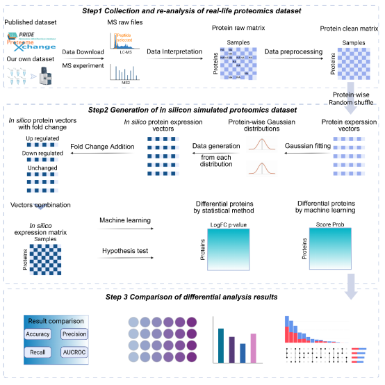

# Differential_analysis

## Introduction
——————————————————————————————————————————



In this study, we evaluated eighteen widely used unsupervised anomaly detection algorithms for differential analysis in proteomics. The performance of these algorithms was compared with that of the well-established statistical pipeline, Welch’s test and Limma, using both in silico simulated datasets and real-life cohort datasets. Our benchmark study highlights the most effective unsupervised machine learning algorithms, e.g., K-Nearest Neighbor (KNN) and Minimum Covariance Determinant (MCD), for differential analysis and outlines the distinct advantages of machine learning approaches over traditional statistical test pipeline.

## Dependency
——————————————————————————————————————————

The following software and packages are required:
* python
* pyod (alone with its dependencies)

The following Python packages integrated in Anaconda:
* numpy
* pandas
* matplotlib


## Usage
——————————————————————————————————————————
Prepare a protein quantification data for your benchmark.
You can also use the data provided in our publication.
please refer to our publication or the main.py file for further information.
```
python main.py --raw_data your_data_path --result_dir your_result_dir
```
For result calculate and threshold decision please refer to utils/aucroc.py and calculate_benchmark_result.py

## License
——————————————————————————————————————————
This project is distributed under a MIT license. See the LICENSE file for details.


## Contacts
——————————————————————————————————————————
Please report any problems directly to the github issue tracker. Also, you can send feedback to liang_qiao@fudan.edu.cn.